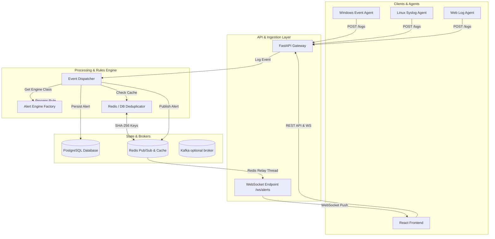
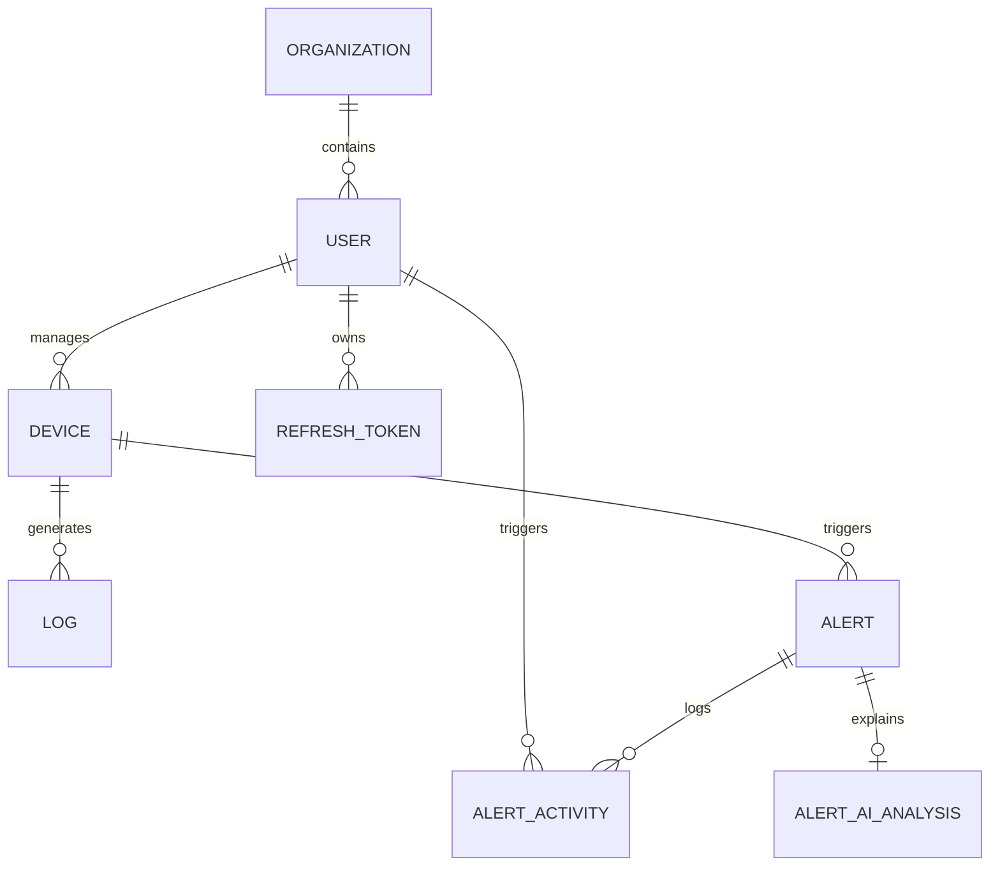
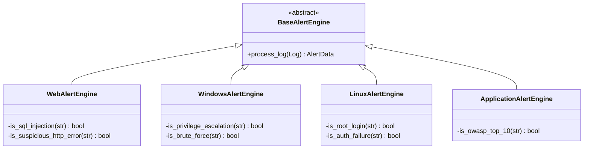

# 🛡️ SecuWatch 2.0 Backend Architecture: Deep-Dive Design Document

This document provides a highly detailed architectural blueprint of the SecuWatch 2.0 Backend. It explains every module, database table, threat engine rule, event routing pipeline, and the security mechanisms used to deliver real-time cybersecurity threat management.

---

## 1. High-Level Architectural Overview

SecuWatch 2.0 is designed as a **highly scalable, multi-tenant, event-driven Security Operations Center (SOC)** backend. The backend manages authenticated sessions, device inventories, log collection pipelines, threat-detection matching, AI threat analysis, and real-time alert dispatching.



---

## 2. Database Schema & Data Models

SecuWatch uses PostgreSQL as its primary database. Database relations are managed via SQLAlchemy ORM classes located in the `app/models/` directory.

### Entity Relationship & Schema Details



#### 1. `Organization` (`app/models/organization.py`)
Represents the tenant boundaries. All users, devices, and alerts are logically partitioned by organization.
*   `id` (`Integer`, PK, Autoincrement)
*   `name` (`String(255)`, Unique, Not Null)
*   `created_at` (`DateTime`, Defaults to UTC now)

#### 2. `User` (`app/models/user.py`)
Users who manage the dashboard.
*   `id` (`Integer`, PK, Autoincrement)
*   `email` (`String(255)`, Unique, Indexed, Not Null)
*   `hashed_password` (`String(255)`, Not Null)
*   `role` (`String(50)`, Default: "analyst")
*   `organization_id` (`Integer`, FK pointing to `organization.id`, Not Null)
*   `created_at` (`DateTime`, Default: UTC now)

#### 3. `Device` (`app/models/device.py`)
Hardware endpoints or application servers running log agents.
*   `id` (`Integer`, PK, Autoincrement)
*   `device_name` (`String(255)`, Not Null)
*   `device_type` (`String(100)`, Not Null) — e.g. "windows", "linux", "web", "application"
*   `api_key` (`String(255)`, Unique, Indexed, Not Null) — Shared secret used by agents to post logs
*   `ip_address` (`String(50)`, Nullable)
*   `status` (`String(50)`, Default: "offline") — e.g. "online", "offline"
*   `last_seen` (`DateTime`, Nullable)
*   `user_id` (`Integer`, FK pointing to `user.id`, Not Null)
*   `created_at` (`DateTime`, Default: UTC now)

#### 4. `Log` (`app/models/log.py`)
Raw streams posted by agents.
*   `id` (`Integer`, PK, Autoincrement)
*   `device_id` (`Integer`, FK pointing to `device.id`, Not Null)
*   `message` (`Text`, Not Null) — Raw log string
*   `timestamp` (`DateTime`, Default: UTC now)

#### 5. `Alert` (`app/models/alert.py`)
Correlated security incidents matching detection rules.
*   `id` (`Integer`, PK, Autoincrement)
*   `device_id` (`Integer`, FK pointing to `device.id`, Not Null)
*   `type` (`String(100)`, Not Null) — Rule category e.g. `SQL_INJECTION_ATTEMPT`
*   `severity` (`String(50)`, Not Null) — Enum: `CRITICAL`, `HIGH`, `MEDIUM`, `LOW`, `INFO`
*   `description` (`Text`, Not Null)
*   `raw_log` (`Text`, Nullable) — JSON string dump of the triggering log details
*   `status` (`String(50)`, Default: `NEW`) — Enum: `NEW`, `IN_PROGRESS`, `RESOLVED`
*   `assigned_to` (`Integer`, FK pointing to `user.id`, Nullable)
*   `assigned_role` (`String(50)`, Default: "analyst")
*   `created_at` (`DateTime`, Default: UTC now)
*   `updated_at` (`DateTime`, Default: UTC now)

#### 6. `AlertActivity` (`app/models/alert_activity.py`)
Audit trail mapping alert triage lifecycle.
*   `id` (`Integer`, PK, Autoincrement)
*   `alert_id` (`Integer`, FK pointing to `alert.id`, Not Null)
*   `user_id` (`Integer`, FK pointing to `user.id`, Nullable) — Actions by users or device agent
*   `action` (`String(100)`, Not Null) — e.g. `CREATED`, `ASSIGNED`, `STATUS_CHANGED`
*   `note` (`Text`, Nullable)
*   `created_at` (`DateTime`, Default: UTC now)

#### 7. `AlertAIAnalysis` (`app/models/alert_ai_analysis.py`)
AI explanation generated on request or on ingestion.
*   `alert_id` (`Integer`, PK, FK pointing to `alert.id`, Not Null)
*   `explanation` (`Text`, Not Null)
*   `why_it_happened` (`Text`, Not Null)
*   `risk_level_reasoning` (`Text`, Not Null)
*   `mitigation_steps` (`Text`, Not Null) — JSON encoded list of action items
*   `model_used` (`String(100)`)
*   `created_at` (`DateTime`, Default: UTC now)
*   `updated_at` (`DateTime`, Default: UTC now)

---

## 3. Core Event Flow & Logging Pipeline

When a security agent posts a log to `/logs`, it flows through the backend sequentially:

```
[Agent Log Post] 
       │
       ▼
[Log Ingestion Route] ── (Verify API Key & Fetch Device Context)
       │
       ▼
[Database Log Entry] ── (Log committed to DB)
       │
       ▼
[Event Dispatcher] 
       │
       ├─► [Get Device-Specific Engine] ── (BaseAlertEngine implementations)
       │
       ├─► [Run Matching Regex Rules] 
       │
       ▼ (If rule matches AlertData)
[Deduplication Check] ── (Cache-first SHA-256 fingerprint window check)
       │
       ▼ (If unique)
[Alert Persistence] ── (Commit Alert + Activity History to Postgres)
       │
       ▼
[WebSocket Manager] 
       │
       ├─► [Publish to Redis Channel]
       │
       ▼ (Relayed by Redis Pub/Sub Daemon)
[WebSocket Client Broadcast] (Organization-scoped target broadcast)
```

---

## 4. Threat Alert Detection Engines

SecuWatch isolates threat signature patterns by device classification. A factory pattern instantiated in `app.services.alert_engine.factory.get_alert_engine(device_type)` routes incoming logs to their corresponding detection engines.

### Detection Signatures Overview



#### 1. Web Detection Rules (`WebAlertEngine`)
*   **SQL Injection Attempt**: Triggered when message contains:
    *   `union.*select`
    *   `or\s+1\s*=\s*1`
    *   `drop\s+table`
    *   `exec\s*\(`
    *   `script\s*>`
    *   `sql.*error` or `syntax error`
    *   *Result: CRITICAL Alert*
*   **Suspicious HTTP Errors**: Triggered on internal error patterns:
    *   `http.*5[0-9]{2}` (5xx codes)
    *   `http.*401` (Unauthorized)
    *   `http.*403` (Forbidden)
    *   `status.*500` or `internal server error`
    *   *Result: MEDIUM Alert*

#### 2. Linux Detection Rules (`LinuxAlertEngine`)
*   **Root Privilege Attempt**:
    *   `sudo:.*session.*opened.*by.*root` or `session opened for user root`
    *   *Result: HIGH Alert*
*   **Failed Authentication Count**:
    *   `failed password for` or `invalid user` or `authentication failure`
    *   *Result: MEDIUM Alert*

#### 3. Windows Detection Rules (`WindowsAlertEngine`)
*   **Privilege Escalation**:
    *   `security.*event.*4672` or `special privilege assigned`
    *   *Result: HIGH Alert*
*   **Brute Force Logon**:
    *   `security.*event.*4625` or `logon failure`
    *   *Result: MEDIUM Alert*

#### 4. Application Detection Rules (`ApplicationAlertEngine`)
*   **Unhandled Runtime Exceptions**:
    *   `exception` or `stacktrace` or `fatal error`
    *   *Result: MEDIUM Alert*

---

## 5. Cache-First Alert Deduplication

To prevent alert flooding, the backend implements cache-first deduplication using Redis. This ensures duplicate alert streams don't overwhelm database transactions.

### Deduplication Logic
1.  **Deduplication Window**: Defined by `settings.alert_dedupe_window_seconds` (defaults to 300 seconds).
2.  **Fingerprint Generation**: The system creates a unique SHA-256 fingerprint from the combined parameters:
    $$\text{Fingerprint Source} = \text{device\_id} \parallel \text{alert\_type} \parallel \text{alert\_severity} \parallel \text{raw\_log\_message} \parallel \text{description}$$
3.  **Redis Setnx Transaction**:
    *   Redis Key: `alerts:dedupe:<sha256_digest>`
    *   Redis Value: JSON metadata (timestamp, log info)
    *   Action: Performs `set(key, value, ex=dedupe_seconds, nx=True)`.
    *   *If Redis returns True*, the key already exists; the event is flagged as a duplicate and immediately suppressed.
    *   *If Redis falls back/fails*, the system queries recent records in the SQL Database matching `created_at >= UTC_now - dedupe_seconds` as a fallback.

---

## 6. Multi-Tenant WebSocket Architecture

Real-time alert dispatching must maintain strict organization borders. The WebSocket manager is multi-tenant and uses Redis Pub/Sub to scale across multiple server processes (e.g. running multiple Uvicorn worker processes).

```
   [FastAPI Endpoint /ws/alerts] 
                │
                ▼ (Validates JWT Token)
   [Checks User's Organization ID]
                │
                ▼
   [Connects Websocket & Binds organization_id]
                │
                ▼
   (Subscribes socket connection to active memory pools)
```

### Event Loop & Redis Relay
1.  **Daemon Relay Loop**: A dedicated daemon thread (`websocket-redis-relay`) runs in the background. It subscribes to the Redis Channel `secuwatch_websocket_broadcasts`.
2.  **Message Parsing**: The channel payload is parsed for `organization_id`:
    ```json
    {
      "id": 1002,
      "device_id": 4,
      "organization_id": 1,
      "type": "SQL_INJECTION_ATTEMPT",
      "severity": "CRITICAL",
      "description": "SQL injection detected...",
      "created_at": "2026-07-08T13:50:00Z"
    }
    ```
3.  **Concurrent Dispatch**:
    *   The Redis thread uses `asyncio.run_coroutine_threadsafe` to invoke the `broadcast(message)` coroutine on the running event loop.
    *   The `broadcast` method runs `asyncio.gather` to concurrently execute `ws.send_json(message)` for all sockets matching the `organization_id`.
    *   If a write fails, the connection is instantly disconnected and purged from the memory pool.

---

## 7. Security, Auth, & Key Management

### Authentication System
*   **Password Hashing**: Done using standard hashing protocols via `bcrypt` / `PBKDF2` implemented inside `app/utils/security.py`.
*   **JWT Access Tokens**: Short-lived tokens storing `sub` (user email), `user_id`, `role`, and `organization_id` inside payload claims.
*   **Database Refresh Tokens**: Long-lived refresh tokens stored inside the `refresh_tokens` table. Expired or revoked sessions delete these tokens, immediately blocking any requests using `/auth/refresh`.

### Device Authorization API Keys
*   Each registered device receives an API key. 
*   **Storage**: Hashed via SHA-256 in the database (`devices` table).
*   **Agent Request Headers**: Agents send requests with:
    `X-Device-API-Key: <plain_api_key>`
*   **Verification**: The request middleware hashes the incoming header and queries the database for a matching record to fetch the associated device context securely.
*   **Masking**: The frontend API filters and masks API keys so the secret value is only accessible to users once during creation.

---

## 8. AI Analysis Service

When an analyst requests AI triage support for a specific alert, the backend performs the following steps:
1.  Verify that the analyst belongs to the same organization as the alert.
2.  Retrieve the alert context, log detail, device details, and recent incidents on the same host.
3.  Inject this information into a structured prompt sent to the LLM configuration context (`settings.llm_model`).
4.  Parse the response into a structured JSON schema:
    *   `explanation`: Plain text explaining what the alert means.
    *   `why_it_happened`: Underlying cause analysis.
    *   `risk_level_reasoning`: Explaining why this represents critical, high, or medium risk.
    *   `mitigation_steps`: An array of clean action items for the analyst to secure the host.
5.  Commit the result to the `alert_ai_analyses` table using an upsert operation so subsequent queries for the same alert ID pull directly from the database cache.
