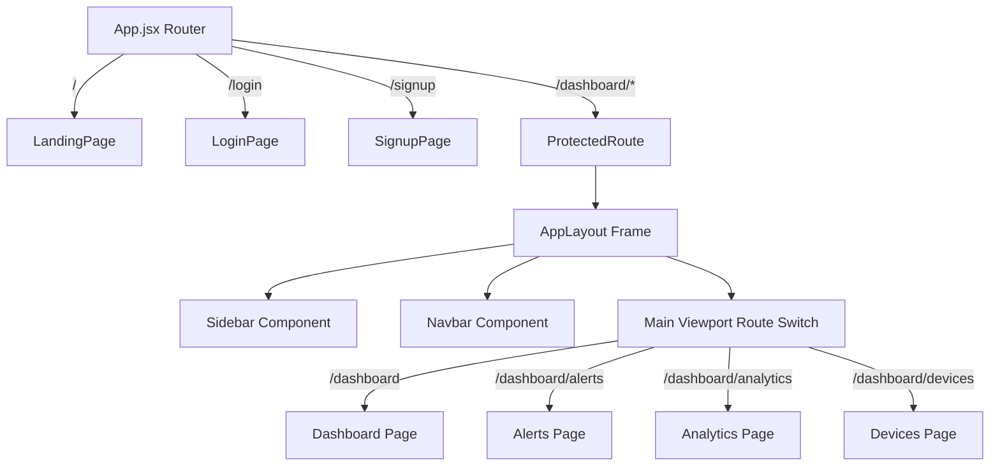
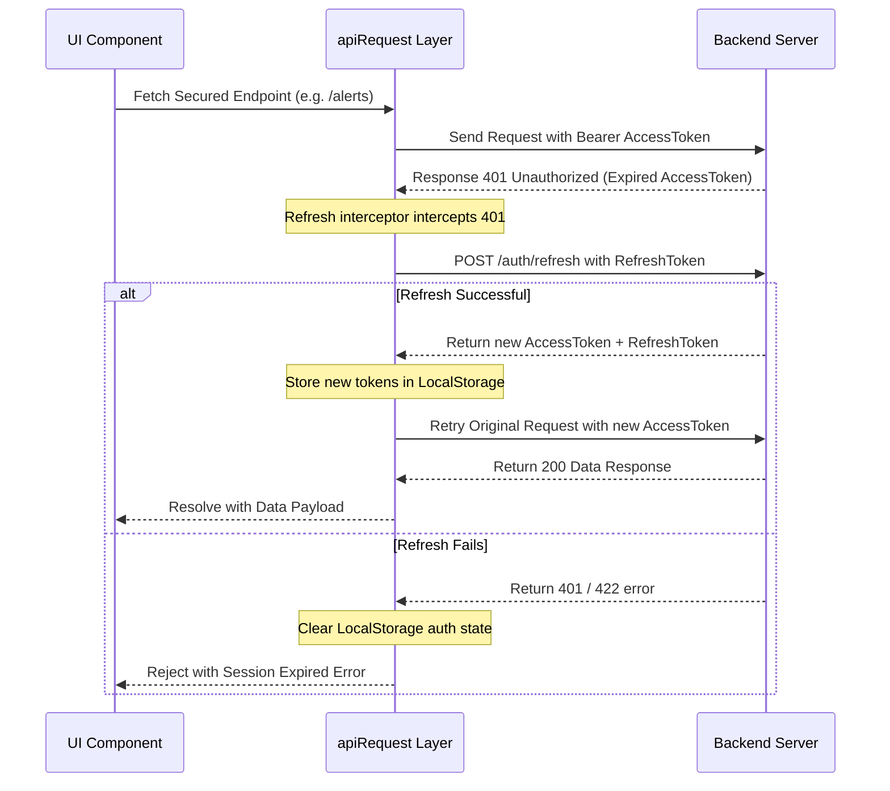

# 🎨 SecuWatch 2.0 Frontend Architecture: Deep-Dive Design Document

This document provides a highly detailed architectural blueprint of the SecuWatch 2.0 React Frontend, explaining its layout system, state context, API layers, page components, and design token integration.

---

## 1. Tech Stack & Styling Foundation

SecuWatch 2.0 is built as a single-page application (SPA) using React, Vite, Tailwind CSS, and standard libraries.

### Core Tech Stack
*   **Vite** (Build Tool & Dev Server)
*   **React 18** (UI Library)
*   **React Router Dom v6** (Client-Side Navigation & Protected Routing)
*   **Recharts** (Data Visualization)
*   **Lucide React** (Icons)
*   **Tailwind CSS v3** (Utility-first styling with custom theme configurations)

### Design & Color System
The app features a custom **pure-black theme with neon-red security accents**, matching modern, high-end SOC and threat dashboard environments:
*   **Base Background (`bg-soc-bg`)**: `#0a0a0a` (Pure jet-black)
*   **Sidebar Panel (`bg-soc-sidebar`)**: `#050505` (Deepest shade of black for panel contrast)
*   **Card Background (`bg-soc-card`)**: `#111111` (Elevated dark gray card backgrounds)
*   **Borders (`border-soc-border`)**: `#1e1e1e` (Minimalist separator lines)
*   **Primary Text (`text-soc-text`)**: `#f0f0f0` (High readability off-white)
*   **Muted Text (`text-soc-secondary`, `text-soc-muted`)**: `#8a8a8a` / `#555555`
*   **Accent Colors**: `#e63946` (`soc-accent` / `soc-info` red) and `#ff6b6b` (lighter neon red)
*   **Severity Highlights**:
    *   *Critical*: `#ef4444` (Vibrant Red)
    *   *High*: `#f97316` (Orange)
    *   *Medium*: `#f59e0b` (Amber/Yellow)
    *   *Low*: `#22c55e` (Emerald Green)

---

## 2. Router & Layout Hierarchy

Navigational mapping is configured in [App.jsx](./Frontend/src/App.jsx). 

### Layout Tree

### Route Components Description
1.  **Landing Page (`/`)**: A rich, public marketing page that displays key features, tech stacks, and how-it-works sections. When users are already authenticated, they are automatically redirected to `/dashboard`.
2.  **Auth Pages (`/login`, `/signup`)**: Minimalist, glassmorphic forms allowing analysts to sign up their organization or log in.
3.  **ProtectedRoute Guard**: Checks the session loading state. If unauthenticated, it stores the path user attempted to visit (`location.pathname`) and redirects to `/login`.
4.  **AppLayout Context**: Employs a flex frame. Includes the left `Sidebar`, the top `Navbar`, and a main scroll container hosting the actual dynamic pages inside a nested `<Routes>` component.

---

## 3. Global Authentication & Context state

State is localized using React Context in `src/context/AuthContext.jsx`.

### Core Properties & Methods
*   `user`: Object containing `{ id, email, role, organization_id }` or `null`.
*   `isLoading`: Boolean flag representing session bootstrap state.
*   `isAuthenticated`: Helper derived from `Boolean(user)`.
*   `login({ email, password })`: Invokes API call, stores tokens, fetches profile context, and populates `user`.
*   `signup({ email, password, organization_name, role })`: Registers organization, registers administrative user, triggers login handshake.
*   `logout()`: Invokes endpoint logout cleanup and clears all localStorage tokens.

### Bootstrap Behavior
During mount, `AuthProvider` checks for the presence of token indices. If found, it fetches profile parameters from `/auth/me`. If unauthorized, it flushes local tokens (`clearAuthTokens()`), allowing for silent persistent logins across page reloads.

---

## 4. API Service & Interceptor Layer

All operations targeting the backend communicate via the centralized utility `src/services/api.js`.

### JWT Interception & Token Renewal Flow

### Key Data Transformers
*   `mapSeverityLabel(val)`: Normalizes DB severity text to camel-case labels (`Critical`, `High`, `Medium`, `Low`, `Info`).
*   `mapStatusLabel(val)`: Maps status labels to human-readable strings (`Open`, `Investigating`, `Resolved`).
*   `formatTimeAgo(val)`: Calculates offset times (e.g. "Just now", "10 mins ago", "3 hours ago", "4 days ago").
*   `buildSeverityData(alerts)`: Reduces an array of alerts to structured name-value maps for Recharts Pie charts.
*   `buildAlertsLineData(alerts)`: Categorizes alerts into 4-hour chronological blocks (`00-04`, `04-08`, etc.) for timeline trends.
*   `buildTopSourcesData(alerts)`: Groups alerts by source device ID, returning the top 6 hosts for the IP bar charts.

---

## 5. UI Page Implementation Details

### 1. Landing Page (`LandingPage.jsx`)
*   Uses `bg-grid-pattern` (faint 60px grids) and large blurred absolute radial-gradient glow orbs (`hero-glow`).
*   Features subtle fade-up entries using staggered animation delays (`stagger-1`, `stagger-2`, etc.).
*   Implements glassmorphic cards (`card-glass`) with border-hover-glow borders matching target mouse hover states.

### 2. Dashboard (`Dashboard.jsx`)
*   **Metrics Grid**: 4 custom themed cards displaying Total Alerts, Critical Alerts, Open Alerts, and Alerts Today (Calculated for current 24h window).
*   **WebSockets Ingest**: Hooks into the backend ws stream. On event trigger, it appends the alert to the local alerts array and increments the count.
*   **Charts**: Displays a line trend (Recharts `LineChart`) and pie chart (Recharts `PieChart`).
*   **Recent Activity**: Render-caps recent alerts list at 5 items, formatted inside a custom styled table.

### 3. Alerts Control Center (`Alerts.jsx`)
*   **Filters Panel (`FiltersBar.jsx`)**: Filter list by severity level, source device, time scopes (24h, 7d, 30d), or raw string regex.
*   **Table View**: Colored left-border indicators representing threat severity. Action button allows analysts to call details.
*   **Details Drawer (`AlertDrawer.jsx`)**: Side-panel slider. Pulls JSON payload, displays specific alert activities, and includes options to assign alerts (pulls list of organization users) or update triage states (Open → Investigating → Resolved).

### 4. Advanced Analytics (`Analytics.jsx`)
*   Pulls extensive historical dataset (up to 200 logs).
*   Displays Alerts timeline trends, distribution metrics, and top device alerts (Recharts `BarChart`).
*   Calculates statistical KPIs: Average Response Time, Resolution Rate (percentage of resolved alerts), and False Positive rate (matching tags containing "FP" or "false positive").

### 5. Devices Portal (`Devices.jsx`)
*   Displays table of registered device clients, operating system names, status, and IP mapping.
*   **Configuration Manager**: Allows adjust of heartbeat thresholds, minimum/maximum logging rates, and toggles local machine detection rules.
*   **API Key Handler**: Displays API keys securely. Leverages Web Clipboard APIs to copy values safely.
